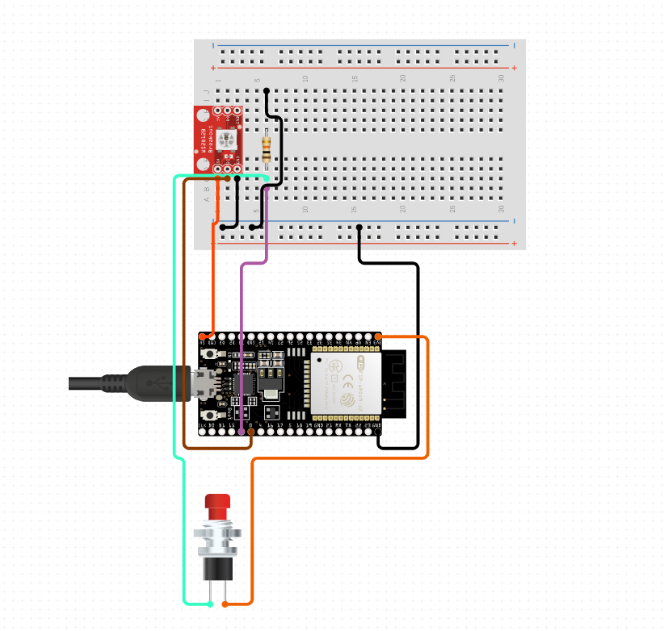

# ESP32 Alarm

The idea behind this project is to make a small LED Cube which shows a color once the desired time has reached.
This can for example remind you to take your pills or something. After that you can disable the LED by pressing the button.

I've mounted my limit switch inside some soft packing foam so I can press the whole cube to disable the alarm.

# Contribution

If you have implemented something cool feel free to send me a PR.

# Docs

## Unimplemented stuff

I've wanted to run it on a battery so I chose a C3 Pico from Wemos.
Unfortunately the TimeAlarms didn't work with Deep Sleep for me so I chose to run it on an USB Power supply because that's available at the Cube location anyways.

It would be great if we had a webinterface to configure the alarms but I didn't bother either.

## Hardware

* [Lolin C3 Pico][c3_pico]
* [WS2811 Circuit Board][ws2811_board]
* [10mm RGB LED](rgb_led_10mm)
* [100mm LED Cube](led_cube) (Sold as Night light on Aliexpress)
* [Button](button) (I've used a CNC end switch)
* 10 kOhm Resistor

The exact same parts I bought are no longer available on Aliexpress (They laid on my shelf for some years) so I tried to find replacements for them. They should work just fine..

## Circuit

Below is an image of the circuit. This can be edited on [Circuitio.io][circuitio_diagram]

[button]: https://www.aliexpress.com/item/4001033375208.html
[rgb_led_10mm]: https://www.aliexpress.com/item/1005001921790732.html
[led_cube]: https://www.aliexpress.com/item/4001166044425.html
[ws2811_board]: https://www.aliexpress.com/item/32985655642.html
[c3_pico]: https://www.wemos.cc/en/latest/c3/c3_pico.html
[circuitio_diagram]: https://www.circuito.io/app?components=513,360217,758938,942700